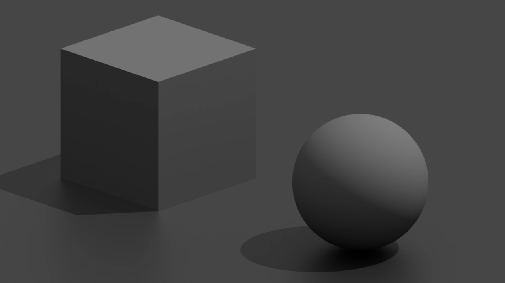

# Nuke Gizmos and Tools

## TriplanarBlink

A high-performance triplanar projection node utilizing Nuke's BlinkScript engine. This tool projects textures onto 3D geometry using Position and Normal passes.

### Features

- **Texture Projections**: Projects up to 3 different textures based on the X, Y, and Z axes.
- **High-Quality Sampling**: Includes Linear, Bilinear, and Anisotropic filtering to reduce blur at oblique angles.
- **Flexible Controls**:
  - Global and per-axis Translate, Rotate, and Scale.
  - Normal channel rotation and scale.
  - Output controls to view the merged result or isolate specific axes.
  - `Blend Exponent` to control the sharpness of the transition between projections.
  - `Apply X Texture on All Axis` toggle for quick single-texture mapping.
  - `Apply Texture Alpha` toggle to apply the alpha from the texture inputs.
- **BlinkScript Acceleration**: Fully vectorized for CPU and supports GPU acceleration.
- **Open Source**: I've included the full source of the kernel (with comments) and gizmo if you want to learn from it or modify it yourself.

### Usage

1. Add the **TriplanarBlink** node to your script.
2. Set the **Position** (P) and **Normal** (N) AOV inputs.
3. Connect your **X**, **Y**, and **Z** textures to the corresponding inputs.
4. Adjust the controls to fine tune the look.
